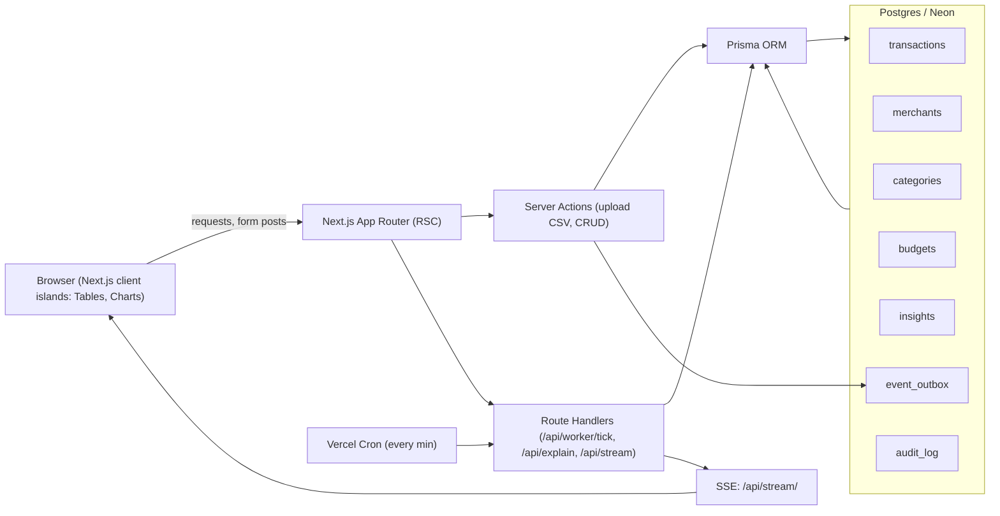

# Architecture — TEBA MVP (Transaction Enrichment & Budget Alerts)

This document explains the high-level architecture, data model, and the lifecycle of a transaction from ingestion to insights.

---

## Table of Contents

1. [System Overview Diagram](#system-overview-diagram)
2. [Event Processing Sequence](#event-processing-sequence)
3. [Entity–Relationship (ER) Diagram](#entityrelationship-er-diagram)
4. [Transaction Lifecycle (State Diagram)](#transaction-lifecycle-state-diagram)
5. [Design Notes & Tradeoffs](#design-notes--tradeoffs)

---

## System Overview Diagram



RSC + Server Actions for fetch/mutations; Route Handlers for worker/explain/stream.
Outbox captures “tx.ingested” events; worker consumes via FOR UPDATE SKIP LOCKED.
SSE nudges the UI to refresh server-rendered KPIs without heavy polling.

### Event Processing Sequence

````mermaid
sequenceDiagram
participant UI as Browser
participant SA as Server Action (/upload)
participant DB as Postgres (transactions, event_outbox, insights)
participant CR as Vercel Cron
participant WK as Route Handler (/api/worker/tick)
participant LLM as LLM (fallback)
participant SSE as /api/stream

UI->>SA: Upload CSV
SA->>DB: Upsert transactions (ON CONFLICT DO NOTHING)
SA->>DB: Insert event_outbox (kind="tx.ingested", ids=[...])

CR->>WK: Trigger /api/worker/tick
WK->>DB: SELECT events FOR UPDATE SKIP LOCKED

loop for each transaction id
WK->>DB: Load tx (raw_description, amount, posted_at)
WK->>WK: Normalize merchant → Categorize (rules)
alt rules miss
WK->>LLM: Classify into known categories
LLM-->>WK: category_code
end
WK->>DB: Update tx (merchant_id, category_id, tags, enrichVer+1)
WK->>DB: INSERT insights if budgets/spikes/recurring detected
end

WK->>DB: UPDATE outbox SET processed_at = now()
WK-->>SSE: Emit invalidation hint
SSE-->>UI: Push live update → RSC re-fetch KPIs

### Entity–Relationship (ER) Diagram

erDiagram
ACCOUNTS ||--o{ TRANSACTIONS : "has many"
MERCHANTS ||--o{ TRANSACTIONS : "provides"
CATEGORIES ||--o{ TRANSACTIONS : "classifies"
CATEGORIES ||--o{ BUDGETS : "used for"
ACCOUNTS ||--o{ BUDGETS : "sets"
ACCOUNTS ||--o{ INSIGHTS : "generates"
TRANSACTIONS ||--o{ INSIGHTS : "trigger"

ACCOUNTS {
uuid id PK
uuid user_id
text name
}

TRANSACTIONS {
uuid id PK
uuid account_id FK
timestamptz posted_at
int amount_cents
text raw_description
text direction
uuid merchant_id FK
uuid category_id FK
text[] tags
int enrichment_version
}

MERCHANTS {
uuid id PK
text display_name
text normalized_name
}

CATEGORIES {
uuid id PK
text code
text name
}

BUDGETS {
uuid id PK
uuid user_id
uuid category_id FK
date month
int amount_cents
}

INSIGHTS {
uuid id PK
uuid user_id
timestamptz created_at
text type
jsonb payload
}

EVENT_OUTBOX {
bigint id PK
text kind
jsonb payload
timestamptz processed_at
}

AUDIT_LOG {
bigint id PK
timestamptz ts
text kind
uuid ref_id
jsonb payload
}

Accounts → Transactions: an account has many transactions.
Merchants/Categories → Transactions: each transaction maps to one merchant & category.
Budgets: tie a category to an account for a given month.
Insights: generated per account, often triggered by transactions.
Event_outbox: reliable event queue. Audit_log: who changed what, when.

### Transaction Lifecycle (State Diagram)

```mermaid
stateDiagram-v2
[*] --> Ingested

Ingested --> DuplicateIgnored : upsert conflict (idempotent)
Ingested --> EnrichmentQueued : outbox row written (tx.ingested)

EnrichmentQueued --> Enriching : worker claims (SKIP LOCKED)
Enriching --> Enriched : rules applied / LLM fallback cached
Enriching --> NeedsReview : no confident category

NeedsReview --> Enriched : user edits or rule added

Enriched --> InsightEmitted : budget breach / spike / recurring
Enriched --> Recategorized : user changes category (audit)
Recategorized --> Enriched : version++

Enriched --> EnrichmentQueued : reprocess requested

InsightEmitted --> [*]
DuplicateIgnored --> [*]
Enriched --> [*]

### Design Notes & Tradeoffs

CSV over Plaid: ship fast; later swap to Plaid for bank connections.
Outbox + cron over queue infra: simpler yet robust; FOR UPDATE SKIP LOCKED enables safe parallel workers.
Rule-first, LLM-second: deterministic, auditable, cheaper; fallback only on misses with caching.
SSE over polling: lightweight near-real-time UI invalidation.
Cents as int: avoid float rounding errors.
````
